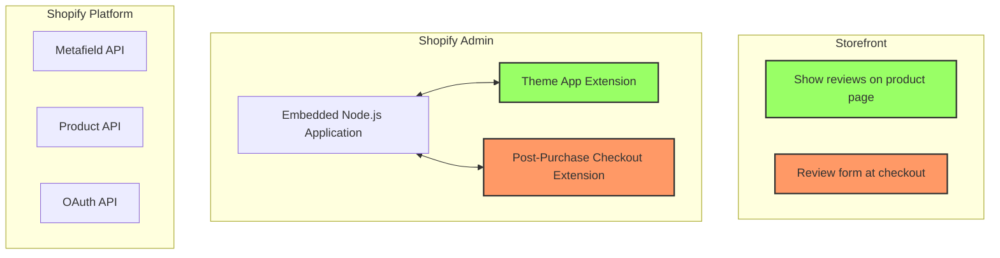

# Product Reviews Sample App

:warning: **WARNING** The application in the repo uses a convention that is no longer the default approach to building a Node.js application on Shopify. Use [this repo](https://github.com/Shopify/shopify-app-node) for the most up-to-date approach for structuring your Node.js Shopify application. 

This sample app was built as a reference to show how Shopify Developer tools can be used together to create a [fully functional application](https://shopify.dev/apps/). The example we chose to showcase is an application that facilitates review creation for products in a Shopify store.

The application is written in [Node.js](https://nodejs.org/) and is comprised of the following elements:

- **[Embedded Node.js application](https://shopify.dev/apps/getting-started/create)**: Displays an admin UI for managing (publishing and unpublishing) reviews.
- **[Theme app extension](https://shopify.dev/apps/online-store/theme-app-extensions)**: Enables review information to be displayed to an online store.
- **[Post-purchase checkout extension](https://shopify.dev/apps/checkout/post-purchase)**: Prompts user to submit a review directly after making a purchase.

Refer to the architecture diagram below to see how the application's components and Shopify interact with each other.

## Tutorials and Instructions 📖

Instructions are provided to show how to setup and run the various components of this code repo. Click on each one to follow an in-depth tutorial.

- **[Installing the embedded Node.js application](docs/getting-started.md)**
- **[Extending the app with a Theme Extension](docs/theme-app-extension.md)**
- **[Add a Post-Purchase Checkout Extensions](docs/checkout-extension-post-purchase.md)**

## Technical Details 💻

To complement the tutorials above, we have documented additional information about how various parts of the application work.

- [Authentication](docs/technical-details/authentication.md)
- [Data layer](docs/technical-details/data-layer.md)
- [Review creation](docs/technical-details/review-creation.md)
- [Product average rating calculation](docs/technical-details/product-average-rating-calc.md)
- [Publishing / Unpublishing reviews](docs/technical-details/publishing-reviews.md)

## Limitations ❕

When using this code keep in mind:

1. This is a sample application. It is not production-ready.
2. Metafields are going to be a bigger part of the platform and will support building applications with more complex data structures.

## APIs and Tools Used 🛠️

### GraphQL

Shopify APIs have previously been available through REST, but more recently the Admin API was made available through GraphQL. Unlike REST APIs, which use multiple endpoints to return large sets of data, GraphQL uses a single endpoint with fields that can be queried to specify the data you need. This generally improves the speed of your app because it’s not asking for data it doesn’t intend to use.

_for more information on the GraphQL Admin API, [check out our reference guide](https://shopify.dev/api/admin-graphql)._

### App Bridge

Shopify App Bridge lets you embed your app directly inside the Shopify Admin. It offers React component wrappers for some actions, and is directly integrated with Polaris components. It offers a consistent experience for merchants, whether it’s on the web or in the Shopify Mobile app for iOS or Android.

_for more information on App Bridge, [check out our reference guide](https://shopify.dev/apps/tools/app-bridge)._

### Metafields

Metafields represent custom metadata attached to a resource (for example, a shop or a product). Metafields can be sorted into namespaces and are composed of keys, values, and value types. They can be used as a data layer to create and store a small amount of information relating to Shopify resources.

_for more information on Metafields, [check out our guide](https://shopify.dev/apps/metafields)._

### Theme App Extensions

Theme app extensions let you extend themes via app blocks. App blocks are liquid files that contain code, a schema and static resource dependencies (CSS, JS). They can be added to existing theme sections or as full-width content on the page. App blocks can also be reordered, removed and configured by merchants directly from the theme editor. Theme app extensions do not modify a theme's code, are served by Shopify, and can be cleanly uninstalled without leaving ghost code behind.

_for more information on Theme App Extensions, [check out our guide](https://shopify.dev/apps/online-store/theme-app-extensions)._

### Post-Purchase Checkout Extension

Post-purchase checkout extensions give developers and Plus merchants the ability to add post-purchase interactions directly into the Shopify checkout. A post-purchase page displays a customizable UI to a buyer after their order is confirmed, but before the thank you page.

_for more information on Post-Purchase Checkout Extensions, [check out our guide](https://shopify.dev/apps/checkout/post-purchase)._

## Contributing

For help on setting up the repository locally, building, testing and contributing please see [CONTRIBUTING.md](CONTRIBUTING.md).

## Code of conduct

All developers who wish to contribute through code or issues, please first read our [Code of Conduct](CODE_OF_CONDUCT.md).

## License

Copyright © 2022 Shopify. See [LICENSE](LICENSE.md) for further details.
