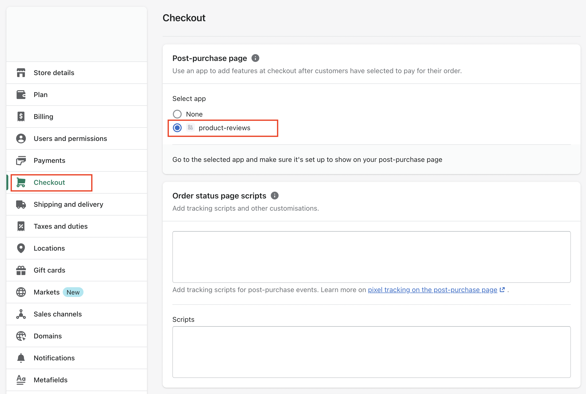
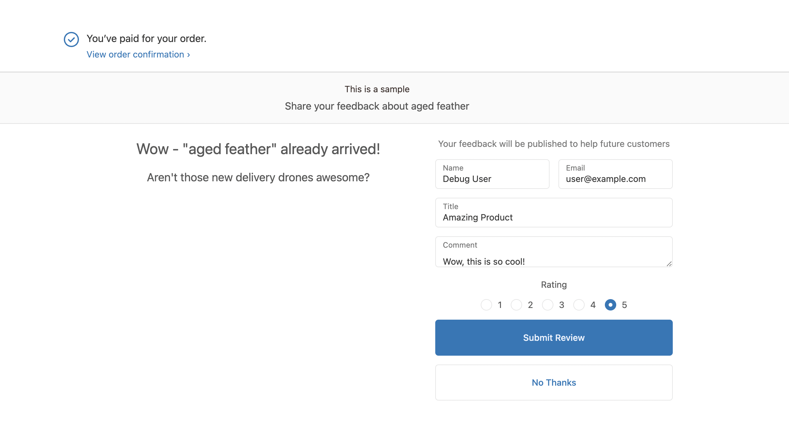

# Installing the Post-Purchase Checkout Extensions

This document contains steps on how to setup and install the post-purchase checkout extension for the Node.js application that was installed in the previous step. Each step in this document begins with a reason for why we're doing that step (_usually written like this_), then some instructions for the reader to perform.

### About Post-Purchase Checkout Extensions

Post-Purchase Checkout Extensions allow merchants to **display an additional page between the checkout payment page and the thank-you page**, prompting the customer to complete some additional action. In the case of this app, the extension asks the customer to submit a review for the product they just bought.

_The code for the post-checkout extension used for this repository is in the [checkout-extension](/checkout-extension) directory._

## Table of contents

1. [Authenticate with the CLI](#1-authenticate-with-the-cli)
1. [Create a `.env` file](#2-create-env-file)
1. [Install the `checkout-ui-extension-run` library](#3-install-the-checkout-ui-extension-run-library)
1. [Update `embeddedAppHost` variable](#4-update-embeddedapphost-variable)
1. [Register the extension](#5-register-the-extension)
1. [Push the extension](#6-push-the-extension)
1. [Publish the extension](#7-publish-the-extension)
1. [Enable the extension](#8-enable-the-extension)
1. [Verify the extension](#9-verify-the-extension)

## 1. Authenticate with the CLI

_Before registering our extension with our store we should ensure the `shopify` CLI is authenticated._

Run the `shopify login` command. The command will return a URL that you need to open in a browser. Once authenticated you can return to the terminal.

```bash
shopify login
```

If you have multiple accounts add a `--shop=<shop-url>` flag like this:

```bash
shopify login --shop=your-test-shop-name.myshopify.com
```

## 2. Create a `.env` file

_The extension we're building will need to an API key and secret. To supply these credentials create a `.env` file in the same directory as the extension._

Go into the extension directory and create the `.env` file:

```bash
cd checkout-extension && touch .env
```

Add the following environment variables to the `.env` file:

```ini
# Your app's API Key. You can find this in your partner dashboard or copy it from the node app .env
SHOPIFY_API_KEY=1234
# Your app's API. Secret You can find this in your partner dashboard or copy it from the node app .env
SHOPIFY_API_SECRET=abcdefg
# This can be whatever you want
EXTENSION_TITLE=my-checkout-extension
```

### 3. Install the `checkout-ui-extension-run` library

_The step installs the [checkout-ui-extensions-run](https://www.npmjs.com/package/@shopify/checkout-ui-extensions-run) library, which adds functionality to the `shopify` CLI._

From the `checkout-extension` folder, run the following command:

```bash
npm install
```

### 4. Update `embeddedAppHost` variable

_The extension needs to know where the main application is being hosted, this is managed via a variable._

Open the [`src/index.js`](/checkout-extension/src/index.js) file and update the variable `embeddedAppHost` to reflect the URL that `ngrok` generated. It should look like the following:

```javascript
const embeddedAppHost = "https://3db4-76-68-94-203.ngrok.io";
```

## 5. Register the extension

_Registering your app extension associates it with an app in your Partner organization. This step should be done only once for each app extension._

To register the extension, run the following command:

```bash
shopify extension register
```

## 6. Push the extension

_Pushing the extension entails of building and compiling a production version of the extension, which is then pushed to the Shopify CDN. (You should see that a build folder has been created with your minified code inside)._

To push the extension, run the following command:

```bash
shopify extension push
```

## 7. Publish the extension

_When you're ready to release your extension you can publish it._

The publish the extension navigate to the following:

_***Partner Dashboard*** > Apps > ***Your App Name*** > Extensions > ***Your Checkout Extension Name***._

Once on the extension page, click on the **_Create version_** button and when the new version appears in the version list, click **_Publish_** next to it.

> :exclamation: To save time, you can preview a draft of your app extension in a development store before creating a version by selecting the **_DEVELOPMENT STORE PREVIEW_** option from the extension's settings page. Note, merchants will not be able to see the changes until a version is published.

## 8. Enable the extension

_By default, extensions are not enabled for online stores, we'll need to change our store's setting to use our new extension._

The enable the extension navigate to the following:

_***Store Admin Settings*** > Checkout > ***Your Checkout Extension Name***_



## 9. Verify the extension

_The last step is to verify that the extension is working as-expected. :question: Note that you'll need to ***setup your test store to accept test orders***. [Follow this short doc](https://help.shopify.com/en/manual/checkout-settings/test-orders) to enable test orders._

From your online store, add a product to your cart and checkout. Pay using a bogus gateway and when the order is placed you'll be prompted to leave a rating and review.

> :exclamation: The extension will only be triggered when a product **has a price**. It will not work with a free product.



## Summary

:tada: Congratulations! If you've reached this step you've completed the last of the tutorials! Go forth and build!
