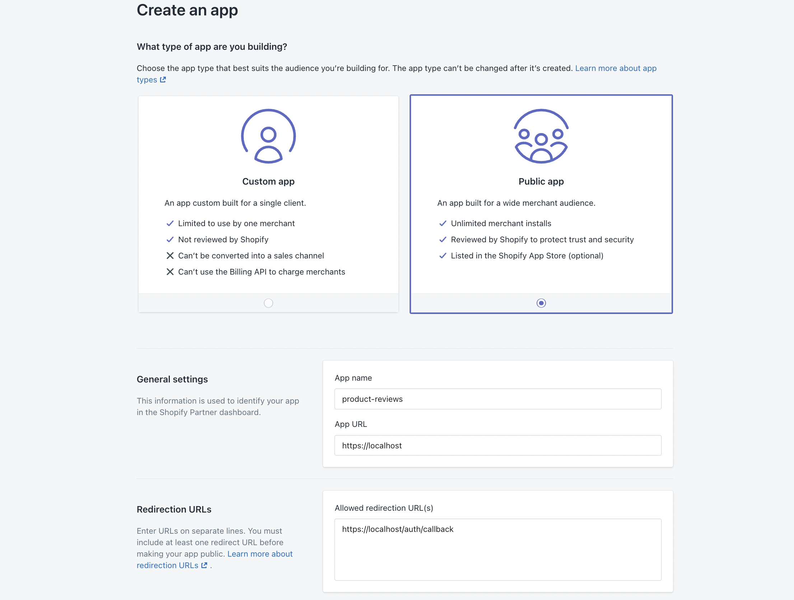
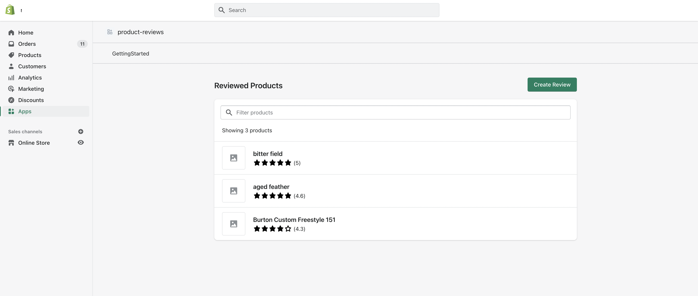

# Installing the embedded Node.js application

This document contains steps on how to setup and install the embedded Node.js application to your Shopify store. Each step begins with a reason for why we're doing that step (_usually written like this_), then some instructions for the reader to perform.

## Table of contents

1. [Clone the repo and install Node.js dependencies](#1-clone-the-repo-and-install-nodejs-dependencies)
1. [Create an app in your Partner account](#2-create-an-app-in-your-partner-account)
1. [Connect to the app with the Shopify CLI](#3-connect-to-the-app-with-the-shopify-cli)
1. [Update API Scopes](#4-update-api-scopes)
1. [Start the application locally](#5-start-the-application-locally)
1. [Update allowed redirection URLs](#6-update-allowed-redirection-urls)
1. [Set up the App Proxy extension](#7-set-up-the-app-proxy-extension)
1. [Install the app in your test store](#8-install-the-app-in-your-test-store)
1. [Verify the embedded app is running](#9-verify-the-embedded-app-is-running)

### Requirements

> :book: We recommend going through the entirety of our [Apps overview](https://shopify.dev/apps/getting-started) guide before going through this tutorial.

#### Shopify Account Requirements

- If you don’t have one, [create a Shopify partner account](https://partners.shopify.com/signup).
- If you don’t have one, [create a Development store](https://help.shopify.com/en/partners/dashboard/development-stores#create-a-development-store) where you can install and test your app.

#### Framework and Tools Requirements

- Install [Node.js](https://nodejs.org/en/download/) on your machine.
- Install [ngrok](https://ngrok.com), in order to create a secure tunnel to your app running on your machine.
- Install the [Shopify App CLI](https://shopify.dev/apps/tools/cli/installation).

> This sample application has been written and tested with Node.js v14 and v16. There are known problems with v17.

## 1. Clone the repo and install Node.js dependencies

_To run this application locally we to get the source code and install the libraries it uses. Let's do that in this step._

Launch a terminal and clone this repo:

```bash
git clone https://github.com/Shopify/product-reviews-sample-app
cd product-reviews-sample-app
```

And install the Node.js dependencies:

```bash
npm install
```

## 2. Create an app in your Partner account

_Once we have an application running locally we'll need to make sure Shopify knows about the application too. This step goes through steps for setting up an application with Shopify Partners, a platform where all app developers must register their applications._

- Visit your [Partner Account dashboard](https://partners.shopify.com/organizations).
- Go to the `Apps` page and click `Create App`.
- Select `Public App`, and choose a name for your app.
- In the `App URL` field enter any url for now (e.g: `https://localhost:3000/`), as this will be automatically updated in the next step.
- Do the same for `Allowed redirection URL(s)`, except add `/auth/callback` to the path like so: `https://localhost:3000/auth/callback`.
- Click `Create App` to confirm.



> :question: **Having issues?** Check out these our [documentation on creating apps](https://help.shopify.com/en/api/tools/partner-dashboard/your-apps#create-a-new-app).

## 3. Connect to the app with the Shopify CLI

_It's now time to connect the two previous steps. We'll make the code we have locally be associated with the application that we just registered through the Shopify Partner's platform._

Back in a terminal, run the `shopify login` command to log into your Partner Account. A URL will print to the terminal, open it in a browser to authenticate.

```bash
shopify login
# optionally pass `--shop=YOUR_SHOP` flag to specify your test store
```

Run the `shopify app connect` command to associate the local code to the newly created app:

```bash
shopify app connect
```

You will be prompted to answer the following questions:

- `To which app does this project belong?` (Select the app you just created in your partner account dashboard).
- `Which development store would you like to use?` (This will only appear if you did not use the `--shop` flag above).

**What just happened?**

A crucial step happens behind the scenes when the `shopify app connect` is run successfully. This step will automatically create a `.env` file in the project root. The file will have a `SHOPIFY_API_KEY`, `SHOPIFY_API_SECRET`, `SHOP` and `SCOPES` values. The `SHOPIFY_API_KEY` and `SHOPIFY_API_SECRET` can also be found in the app settings of your Partner account. `SCOPES` are set to default values. See the [documentation on access scopes](https://shopify.dev/api/usage/access-scopes) for the list of scope options.

## 4. Update API Scopes

_The application we're building will need additional permissions than the default given when creating an app. For that reason we need to edit the `.env` files._

Open the `.env` file using your favorite editor and add `read_themes` to the `SCOPES` variable. This is needed so the app can check if a merchant's theme supports App Blocks. Here's what a `.env` file should look like:

```ini
SHOPIFY_API_KEY=<Your app API key. You can find this in your partner dashboard>
SHOPIFY_API_SECRET=<Your app API secret You can find this in your partner dashboard>
SHOP=<Your shop where you test this app>
SCOPES=write_products,write_customers,write_draft_orders,read_themes
```

## 5. Start the application locally

_It's finally time to start running our application locally. Under the covers this will use `ngrok` to start a tunnel so the locally run application can be reached from the wider internet._

To start the server, run the `shopify app serve` command and answer the prompts:

```bash
shopify app serve
```

- `Do you want to convert <your-store>.myshopify.com to a development store?` (Choose yes)
- `Do you want to update your application url?` (Choose "yes")

> :grey_exclamation: This step will automatically add a `HOST` key to your `.env` file. It will match the URL of the `ngrok` tunnel was created when you ran the last command. ***The command will also update the app URLs in the partner dashboard.***

## 6. Update allowed redirection URLs

_Before we install the application we need to ensure the allowed redirection URL in the application's configuration is correct. Not having these values set up correctly will result in an installation failure as the OAuth handshake will not succeed._

From the Partner Dashboard, navigate to the app setup by going to: _Apps_ > _Your App_ > _App setup_.

The `App URL` should now match the tunnel URL.

```
<YOUR_TUNNEL_URL>
```

The `Allowed redirection URL(s)` should be updated and match the example below:

```
<YOUR_TUNNEL_URL>/offline/auth/callback
<YOUR_TUNNEL_URL>/online/auth/callback
<YOUR_TUNNEL_URL>/auth/callback
```

And then click `Save`.

## 7. Set up the App Proxy extension

_As a best-practise we want to ensure traffic to our application is coming from Shopify storefronts, to do that we need to set up an app proxy._

To configure the App Proxy extension follow the steps below.

1. From your Partner Dashboard, click Apps.
2. Click the name of your app.
3. Click App setup.
4. Navigate to the App proxy section.
5. In the App proxy section, add the following:

   - _Subpath prefix_: `apps`
   - _Subpath_: `prapp`
   - _Proxy URL_: `{YOUR_TUNNEL_URL/api}`

6. Click `Save`.

## 8. Install the app in your test store

_With our application running locally and configured correctly we can now install the application on our test store._

There are two ways to do this:

1. Go back to the terminal and you will see that there was a URL printed after you ran `shopify app serve`. Visit this URL and you will be prompted to install the app on your test store. The URL will look like the example below, note the `auth` route in the URL.

   ```
   https://{YOUR_TUNNEL_URL}/auth?shop={YOUR_SHOP}
   ```

or

2. Click on the `Test you app` button on the app page of the Partner Dashboard to start the install process.

## 9. Verify the embedded app is running

To verify that the embedded app is running navigate to _your test shop_ > _apps_ > _your app name_. From there you'll be presented with an option to create reviews. Click on the `Create Review` button and start reviewing your products. By default all reviews will be in an **unpublished** state. From this view you'll also have the ability to **publish** reviews so they appear on the online store.



## Summary

Congratulations! If you've reached this step you've deployed the product reviews application. Go to the next step, [Adding a Theme Extension](theme-app-extension.md), to extend your online store to see reviews on product pages.
