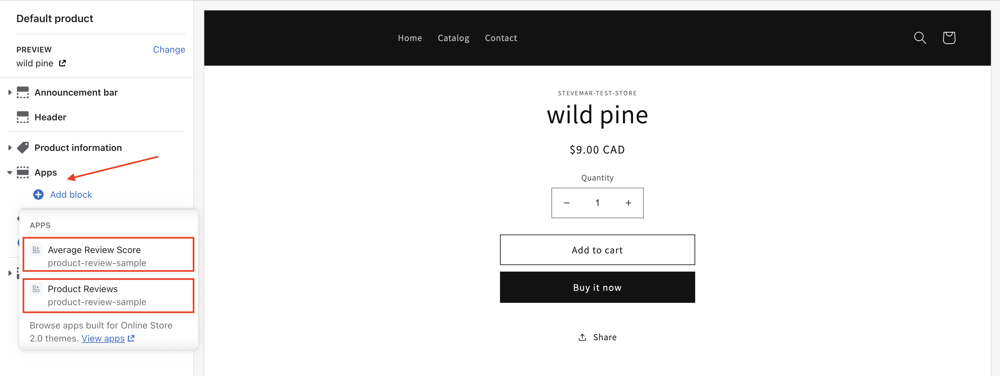
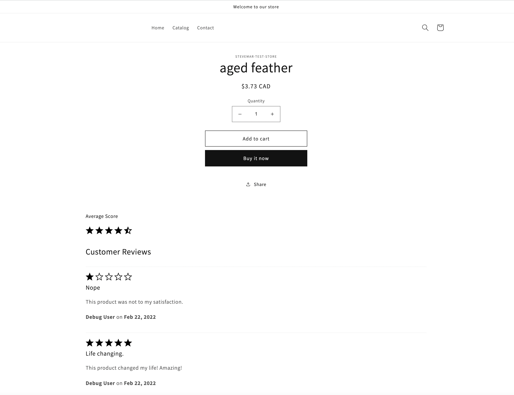

# Installing the Theme App Extension

This document contains steps on how to setup and install the theme app extension for the Node.js application that was installed in the previous step. Each step in this document begins with a reason for why we're doing that step (_usually written like this_), then some instructions for the reader to perform.

### About Theme App Extensions

Theme App Extensions allow you to extend a theme by adding App Blocks to it. Theme App extensions are tied together with an app, so in order to build a theme app extension you need to have an app to register the extension under. **An app can have only one theme app extension. Once registered it cannot be unregistered**

_The code for the theme app extension used for this repository is in the [theme-app-extension](/theme-app-extension) directory._

## Table of contents

1. [Authenticate with the CLI](#1-authenticate-with-the-cli)
1. [Create a `.env` file](#2-create-env-file)
1. [Register the extension](#3-register-the-extension)
1. [Push the extension](#4-push-the-extension)
1. [Publish the extension](#5-publish-the-extension)
1. [Add theme extension blocks](#6-add-theme-extension-blocks)
1. [Verify the extension](#7-verify-the-extension)

## 1. Authenticate with the CLI

_Before registering our extension with our store we should ensure the `shopify` CLI is authenticated._

Run the `shopify login` command. The command will return a URL that you need to open in a browser. Once authenticated you can return to the terminal.

```bash
shopify login
```

If you have multiple accounts add a `--shop=<shop-url>` flag like this:

```bash
shopify login --shop=your-test-shop-name.myshopify.com
```

## 2. Create a `.env` file

_The extension we're building will need to an API key and secret. To supply these credentials create a `.env` file in the same directory as the extension._

Go into the extension directory and create the `.env` file:

```bash
cd theme-app-extension && touch .env
```

Add the following environment variables to the `.env` file:

```ini
# Your app's API Key. You can find this in your partner dashboard
SHOPIFY_API_KEY=1234
# Your app's API. Secret You can find this in your partner dashboard
SHOPIFY_API_SECRET=abcdefg
# This can be whatever you want
EXTENSION_TITLE=my-theme-extension
```

> :question: If we were creating a new extension a `.env` file would be generated automatically. However, since the extension already exists we must create the file instead.
>
> :book: For more information refer to the [theme app extension framework file structure](https://shopify.dev/apps/online-store/theme-app-extensions/extensions-framework#file-structure).

## 3. Register the extension

_Registering your app extension associates it with an app in your Partner organization. This step should be done only once for each app extension._

To register the extension, run the following command:

```bash
shopify extension register
```

## 4. Push the extension

_Pushing the extension entails of building and compiling a production version of the extension, which is then pushed to the Shopify CDN. (You should see that a build folder has been created with your minified code inside)._

To push the extension, run the following command:

```bash
shopify extension push
```

## 5. Publish the extension

_When you're ready to release your extension you can publish it._

The publish the extension navigate to the following:

_***Partner Dashboard*** > Apps > ***Your App Name*** > Extensions > ***Your Theme Extension Name***._

Once on the extension page, click on the **_Create version_** button and when the new version appears in the version list, click **_Publish_** next to it.

> :exclamation: To save time, you can preview a draft of your app extension in a development store before creating a version by selecting the **_DEVELOPMENT STORE PREVIEW_** option from the extension's settings page. Note, merchants will not be able to see the changes until a version is published.

## 6. Add theme extension blocks

_By default the online store's theme is not changed just because a new theme extension is published. We'll need to go to our theme editor and add the specific blocks we want to show._

The enable the new theme blocks we need to launch the _Theme Editor_:

_***Store Admin*** > Online Store > ***Themes*** > Customize_

From within the the _Theme Editor_ click on any product to bring up a new selection of items in the left navigation bar.

From the **_Apps_** block, choose to add the "**_Average Review Score_**" and the "**_Customer Reviews_**" sections. Save theme and exit the editor.



> :exclamation: Theme App Extensions can only integrate with Online Store 2.0 themes such as the default Dawn theme, which is Shopify's Online Store 2.0 reference theme.

## 7. Verify the extension

_The last step is to verify that the extension is working as-expected._

From your online store navigate to a product that has at least one published review. You should now be able to see reviews and ratings from users.



## 8. (Optional) Add theme support detection to the embedded application

A quick way to check if things are set up correctly is to perform the steps below. This will show if your theme and store can use the extension, the results will be shown in the embedded application.

- Add a new variable `THEME_APP_EXTENSION_UUID` to your app's `.env` (in the project root). Set the value to the same as `EXTENSION_UUID` in `theme-app-extension/.env`. This will allow the app to check which blocks have already been added to the merchant's Product Pages using the theme editor.

- Add a Navigation Link to the `/getting-started` route via the Partner Dashboard: _App Setup_ > _Embedded App (Manage)_ > _Navigation (Configure)_ > _Add Navigation Link_

## Summary

Congratulations! If you've reached this step you've deployed the theme extension. Go to the next step, [Adding a Post Checkout Extension](checkout-extension-post-purchase.md), to add reviews after a customer has purchased a product.

---

## FAQ

**Q: I'm getting a 401 error code, what's wrong?**

A: This means your authentication session has expired and you need to rerun `shopify login`.

**Q: I can't see my app blocks in my Theme Editor.**

A: After you use the CLI command `shopify extension push` you must go to the extension page in the partner dashboard. Create a new version of the extension. Publish the version, to push it live to merchants.

**Q: I added the product reviews block but the I cannot see the add reviews form.**

A: In the App Block settings in the Theme Editor ensure `Allow unverified review submissions` is selected.

**Q: I'm seeing an `incorrect schema of the block` error, what's wrong?**

A: The CLI will infrom you about the issue and what is wrong when trying to push your code changes. Go on and fix those issues and push afterwards.

**Q: I cannot see the average review block**

A: The average review block will appear once at least one review has been submitted and approved. You must approve the review in the app admin.

**Q: I cannot see blocks in the theme editor**

A: In order to make blocks visible in your theme editor you need to add `@app` in blocks under needed section schema. Also you'll need to add in order to make it render where you need in the UI:

```liquid

  
  
    
  

```

For example in `dawn` theme you would head to edit theme code and modify `main-product.liquid` file. Find `blocks` in `schema` and add this:

```liquid
{
  "type": "@app"
}
```

Then in the html template code portion you'll find the ``, so simply add within it this snippet:

```liquid

  

```

You should then see your blocks in theme editor under product page product section and if you'll select one of the blocks it will appear in sidepannel where Name, Price and other info about the product is present.
